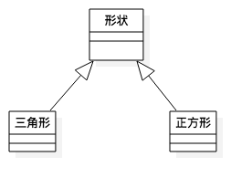
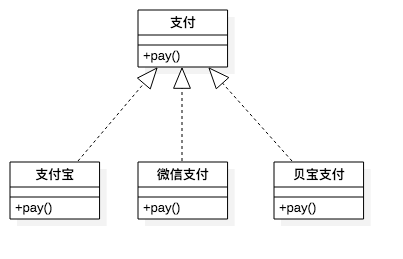
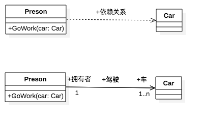
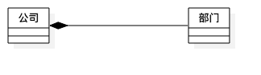
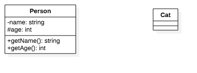

# 类图

## 类图\(ClassDiagraml 这个选项\)

```text
类图是面向对象系统建模中最常用的图. 是定义其他图的基础.
类图主要是用来显示系统中的类,接口以及它们之间的关系.
类图包含的主要元素有类,接口和关系. 其中关系有 泛化关系,关联关系,依赖关系和实现关系. 在类图中也可以包含注视和约束.
```

* **类的表示方法:**
  * 类是类图的主要组件,由3部分组成, 类名,属性和方法. 在UML中类用矩形来表示,顶端放类的名称,中间部分存放类的属性,属性的 类型及值,底部部分存放类的方法,方法的参数和返回类型.
  * 在 UML 中可以根据实际情况有选择的隐藏部分或方法部分或两者都隐藏.
  * 在 UML 中, public类型用 + 表示,private类型用 - 表示,protected用 \# 表示.也可以自定义每个类型的表示符号.


### 类之间的关系- 泛化关系\(也就是继承关系\)

**`泛化关系用来表示类与类,接口与接口的继承关系.泛化关系有时也称为 "is a kind of" 关系.`**

 **`在 UML 中, 泛化关系用 一条实线空心箭头 由自类指向父类. (Generalization 这个选项的箭头)`**



### 类之间的关系- 实现关系 \(子类来实现父类的虚或纯虚函数成员\)

**`在 UML 中, 实现关系用来表示 类与接口之间的实现关系.`** 

**`在 UML 中, 实现关系用 一条虚线空心箭头 由自类指向父类.(Realization)`**



### 类之间的关系- 依赖关系 \(调用成员依赖于被调用成员,比如一个类中的方法调用了另一个类的指针参数\)

**`对于两个 相对独立 的系统,当一个系统负责构建另一个系统的实例,或者依赖另一个系统的服务时,这两个系统之间体现为依赖关系.`**

**`在 UML 中, 依赖关系使用 虚线小箭头 自调用成员指向被调用成员.(Dependency)`**



### 类之间的关系- 关联关系 \(两个类,一个类把另一个类变成了自己的一个成员\)

**`对于两个相对独立的系统,当一个系统的实例与另一个系统的一些特定实例存在 固定的对应关系 时,这两个系统之间为关联关系.`**

**`在 UML 中, 关联关系使用 实线小箭头 自调用成员指向被调用成员.(Directed Association)`**


#### 关联关系的名称

**关联关系的名称:**`关联关系可以有一个名称,用于描述该关系的性质.此关联名称应该是动词短语,因为他表明源对象正在目标上执行动作.`

#### 关联关系的角色

**关联关系的角色**:**`当一个类处于关联的一端时,该类就在这个关系中扮演一个特定的角色.具体来说,角色就是关联关系中一个类对另一个 类所表现的指责. 角色名称是名词或名词短语.`**

#### 关联关系的多重性

**关联关系的多重性**:**`是指有多少个对象可以参与该关联,多重性可以用来表达一个取值范围,特定值,无限的范围.`**


### 类之间的关系-聚合 \(整体与部分之间是可以分离的,它们可以具有各自的生命周期,部分可以属于或共享多个整体对象,\)

* 聚合关系是关联关系的一种,是更强的关联关系.
* 聚合时整体的部分之间的关系,例如汽车由引擎,轮胎以及其他零件组成.
* 聚合关系也是通过成员变量来实现的. 但是关联关系所涉及的两个类处在同一层次上,而聚合关系中,两个类处于不同层次上, 一个代表整体,一个代表部分.

**`在 UML 中, 聚合关系使用 棱形空心实线箭头 由部分指向整体. (Aggregation)`**


### 类之间的关系-组合 \(也称为强聚合,如果整体的生命周期结束,那么部分的生命周期也会结束\)

* UML 类图关系中合成关系是关联关系的一种,是比聚合关系还要强的关系.
* 代表整体的对象负责代表部分对象的生命周期.

**`在 UML 中, 组合关系使用 棱形实心实线箭头 由部分指向整体. (Composition)`**






