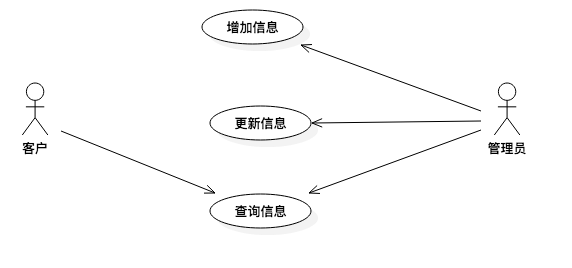
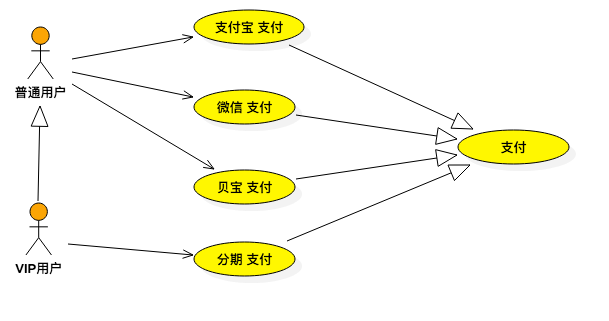
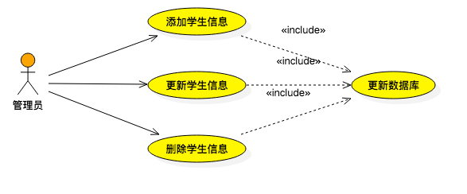
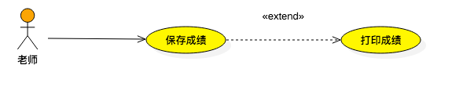

# 用例图

## 用例图

* **用例图\(Use case Diagram\)**
  * 也称用户建模图,是从软件需求分析到最终实现的第一步,它是从客户的角度来描述系统功能的.
* **用例图包含 3 个基本组件**
  * `参与者(Actor):`
    * 与系统打交道的人或其他系统即 使用该系统和人和事物.在UML中参与者用人形图标表示.
  * `用例(Use Case):`
    * 代表系统的某项完整的功能. 在UML中使用一个椭圆来表示.
  * `关系 :`
    * 定义用例之间的关系 --- 泛化关系, 拓展关系, 包含关系.

### 用例之间的关系

* **用例之间的关系- 泛化关系 :**
  * 表示同一业务目的\(父用例\)的不同技术实现\(各个子用例\).
  * `在 UML 中 用例泛化用一个三角箭头从子用例指向父用例.`
* **用例之间的关系- 包含关系 :**
  * 一个用例 可以包含其他用例具有的行为,并把它包含的用例行为作为自身行为的一部分,
  * `在 UML 中 包含关系用虚线箭头加 "<>" , 箭头指向被包含的用例.`
* **用例之间的关系- 扩展关系 :**
  * 如果在完成某个功能的时候 偶尔会执行另外一个功能,则用扩展关系表示.
  * `在 UML 中 拓展关系用虚线箭头加 "<>", 箭头指向被扩展的用例.`

